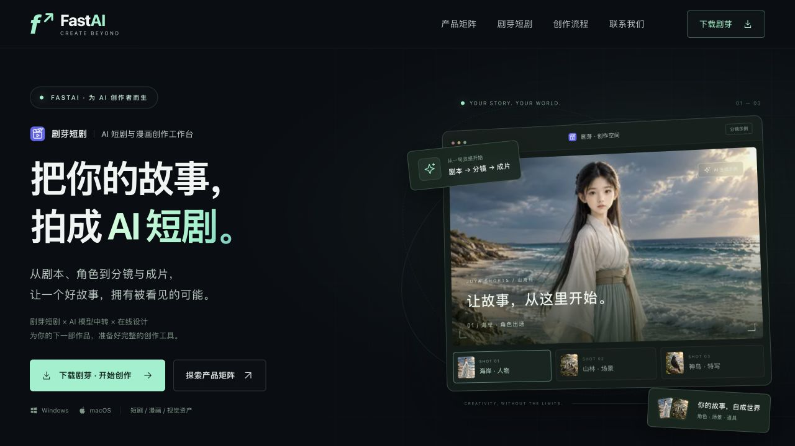

# FastAI 官网

面向 AIGC 业务的独立品牌官网，介绍剧芽短剧、AI 模型中转站与在线设计平台，并提供桌面安装包下载和商务联系方式。

源码仓库：[fastaiapi-groups/juya-web](https://github.com/fastaiapi-groups/juya-web)。部署域名：`web.fastaiapi.cloud`，Docker 宿主机端口：`6668`。

采用深色背景、薄荷绿光效、轨道线条和创作工作台展示，支持桌面、平板与手机。首屏突出「把你的故事，拍成 AI 短剧」，并提供可切换的三组 AI 分镜。产品矩阵通过绿色、蓝色、紫色区分剧芽、中转站和在线设计，展示真实产品能力、使用人群与直接入口；其后为剧芽工作台示意、四步创作流程、Windows / macOS 下载以及联系区。页面资源均在本地，不依赖外部字体、图片 CDN 或前端框架。使用原生 HTML / CSS / JavaScript 和 Nginx，运行不需要 Node.js、数据库或 API 密钥。



[产品矩阵预览](docs/preview-products.png) · [手机预览](docs/preview-mobile.png)

## 本机已启动

本机 HTTP 服务监听 `http://127.0.0.1:6668`。6668 属于 Chromium 等浏览器限制直连的端口，请通过部署后的 **https://web.fastaiapi.cloud** 访问；本机检查可使用：

```sh
curl http://127.0.0.1:6668/healthz
```

当前本地 `.env` 将下载目录设为 `../fastai-drama/desktop/release`，直接读取已有的 4.0.10 安装包，不复制大文件。Docker 映射为 `0.0.0.0:6668:80`，官网域名为 `web.fastaiapi.cloud`。此 `.env` 的下载目录适用于当前工作区，不提交到 Git；迁移到服务器时按照下方步骤重新配置。

## Docker 启动

需要 Docker Engine / Desktop 和 Docker Compose v2。

```sh
git clone git@github.com:fastaiapi-groups/juya-web.git
cd juya-web
cp .env.example .env
# 默认安装包目录为 /opt/fastaiapi-groups/juya-web/download
mkdir -p /opt/fastaiapi-groups/juya-web/download
docker compose up -d --build
```

小皮面板服务器若提示 `docker: 'compose' is not a docker command`，使用面板自带的 `docker-compose up -d --build`（其余命令同样替换为 `docker-compose`）。

默认绑定 `0.0.0.0:6668:80`。浏览器访问使用反向代理后的 **https://web.fastaiapi.cloud**，域名部署方式见下文。首次构建需要拉取 `nginx:1.28-alpine`。修改网页源码后运行相同命令即可更新。

```sh
docker compose ps
docker compose logs --tail=100 website
docker compose down
```

停止容器不会删除宿主机上的安装包或配置。容器包含 `/healthz` 健康检查。

## 配置下载目录

服务器安装包固定存放在 `/opt/fastaiapi-groups/juya-web/download`，Compose 默认将该目录只读映射到容器 `/srv/downloads`：

```sh
mkdir -p /opt/fastaiapi-groups/juya-web/download
```

将安装包放入该目录，并编辑 `.env`：

```dotenv
WEBSITE_PORT=6668
WEBSITE_BIND=0.0.0.0
DOWNLOADS_DIR=/opt/fastaiapi-groups/juya-web/download
```

Compose 将 `DOWNLOADS_DIR` 以只读方式映射到容器 `/srv/downloads`。宿主机目录必须事先存在。生产部署建议使用绝对路径；如果使用本机 Nginx / Caddy 反向代理，将 `WEBSITE_BIND` 设为 `127.0.0.1`。

配置文件 `config/site.json` 同样以只读目录映射到容器 `/etc/fastai`。公开地址 `/site-config.json` 读取该文件。**此文件的内容会公开展示，只放版本、链接与公开联系方式。**

通过服务器面板的「文件」管理器进入 `/opt/fastaiapi-groups/juya-web/download`，使用「上传」将以下三个安装包放入目录根层，保留文件名：

| 系统 | 安装包 |
| --- | --- |
| Windows | `JuyaDrama Setup 4.0.10.exe` |
| macOS Apple 芯片 | `JuyaDrama-4.0.10-arm64.dmg` |
| macOS Intel 芯片 | `JuyaDrama-4.0.10.dmg` |

服务器 `.env` 中的 `DOWNLOADS_DIR` 必须设为 `/opt/fastaiapi-groups/juya-web/download`。若原先映射到其他目录，更新后运行 `docker compose up -d --build`。前端继续使用 `/downloads/文件名`，网址中的复数 `downloads` 与宿主机目录名 `download` 各自有明确用途。

三个安装包的 SHA-256 与大小记录在 `config/installers-checksums.json`，可在上传后比对服务器的 `sha256sum` 输出。安装包不提交到 Git，也不复制进 Docker 镜像。

```text
宿主机 /opt/fastaiapi-groups/juya-web/download/安装包.dmg
           ↓ 只读挂载
容器 /srv/downloads/安装包.dmg
           ↓ Nginx
官网 /downloads/安装包.dmg
```

## 修改版本、下载链接与联系方式

编辑 `config/site.json`，例如：

```json
{
  "version": "4.0.10",
  "downloads": [
    {
      "platform": "windows",
      "label": "Windows",
      "requirement": "64 位安装程序 · EXE",
      "filename": "JuyaDrama Setup 4.0.10.exe"
    },
    {
      "platform": "mac",
      "label": "macOS · Apple 芯片",
      "requirement": "M 系列芯片 · DMG",
      "filename": "JuyaDrama-4.0.10-arm64.dmg"
    }
  ]
}
```

以上是下载配置的节选，修改时保留原文件中的其他字段。

| 字段                      | 用途                                                       |
| ------------------------- | ---------------------------------------------------------- |
| `version`                 | 下载区显示的统一版本号                                     |
| `downloads[].filename`    | 宿主机下载目录根层的文件名，必须准确匹配，支持空格与中文   |
| `downloads[].platform`    | `windows` 使用 Windows 图标，`mac` 使用 Apple 图标         |
| `downloads[].label`       | 平台名称                                                   |
| `downloads[].requirement` | 芯片、架构、文件格式等说明                                 |
| `platforms.api`           | AI 模型中转站地址                                          |
| `platforms.design`        | 在线设计平台地址                                           |
| `email`                   | “聊聊你的想法”按钮的收件邮箱                               |
| `contacts`                | 联系卡片的名称、显示账号和链接，`url` 支持 HTTPS 或 mailto |
| `contacts[].platform`     | 平台图标：`email`、`telegram`、`whatsapp`、`x`、`qq`、`qq-group`；不填时按名称识别 |
| `icp`                     | 备案号；留空隐藏，填写后链接到工信部备案网站               |

下载 URL 自动拼接为 `/downloads/` 加经过编码的文件名。前端通过 HEAD 检查文件存在性，并显示真实文件大小；不存在或无法获取时显示“暂未上架”，不提供失效下载链接。

QQ 群卡片使用 `{"label":"QQ 群","platform":"qq-group","value":"48878665"}`，点击复制群号后在 QQ 搜索加入，无需配置邀请链接。

下载端点支持 `EXE / DMG / ZIP / AppImage / DEB / RPM`，文件名大小写应与实际文件一致。不开放目录列表、子目录、符号链接和其他格式，避免把发行目录中的配置、校验记录等一并暴露。Nginx 提供附件响应和 Range 支持，可续传大文件。

**发布新版本：**先上传完整的新安装包到宿主机目录，再修改配置中的版本和文件名。大文件建议上传为临时后缀，完成后重命名，以免下载到未传完的文件。配置修改和安装包替换均无需重建或重启，刷新页面即可读取；改变 `.env` 的目录或端口后需要重新执行 `docker compose up -d`。

## 域名部署

官网域名为 **https://web.fastaiapi.cloud**，页面 canonical 与分享链接均使用该域名。容器提供 HTTP 服务，宿主机绑定 **6668** 端口。将域名 DNS 指向部署服务器，由现有 Nginx / Caddy 管理 HTTPS 证书并转发到官网。

如果 Caddy 直接运行在与官网容器相同的宿主机，将 [docker/Caddyfile.example](docker/Caddyfile.example) 的以下配置合入服务器上现有的 Caddyfile，然后校验并重载 Caddy：

```caddyfile
web.fastaiapi.cloud {
    reverse_proxy 127.0.0.1:6668
}
```

如果 Caddy 自身运行在另一个容器中，`127.0.0.1` 指向 Caddy 容器自身。此时应代理到可访问的宿主机地址的 `6668` 端口，或将两者接入同一 Docker 网络后代理到 `website:80`。

使用现有 Nginx 时，在 `server_name web.fastaiapi.cloud;` 的域名 `server` 块中配置：

```nginx
location / {
    proxy_pass http://127.0.0.1:6668;
    proxy_set_header Host $host;
    proxy_set_header X-Real-IP $remote_addr;
    proxy_set_header X-Forwarded-For $proxy_add_x_forwarded_for;
    proxy_set_header X-Forwarded-Proto $scheme;
}
```

不要把两个业务平台的域名改为官网域名；官网上的按钮保留其独立入口。

## 项目结构

```text
fastai-website/
├── public/
│   ├── index.html         页面结构与业务文案
│   ├── styles.css         视觉样式与响应式布局
│   ├── showcase.css       首屏、分镜交互与产品矩阵样式
│   ├── app.js             配置读取、下载检查和导航交互
│   └── assets/            品牌图标与本地示例画面
├── config/site.json       可热更新的公开网站配置
├── docker/nginx.conf      静态站、下载与健康检查配置
├── download/              宿主机安装包目录（不提交安装包）
├── Dockerfile
├── compose.yaml
└── .env.example
```

## 素材与展示说明

剧芽图标来自当前工作区 `fastai-drama/frontend/src/assets/brand-logo.svg`。三张示例图片来自该项目 `docs/ui-verification/material-thumbs/shot18.webp`、`shot15.webp` 与 `shot16.webp`，分别用于海岸、森林与神鸟画面。官网中的工作台和设计画布用于说明产品能力，已标注示例或示意。联系方式采用现有剧芽 README 的公开联系信息。

产品矩阵的信息组织参考 `https://www.chatfire.site/#products`，使用本项目自身的品牌、素材与文案。设计平台的生图、套图、图像编辑与节点画布能力依据 `https://design.fastaiapi.cloud` 的公开页面整理；未采用参考网站的性能数字、可用性承诺或其他产品专属能力。

## 验证记录

已在本机实际构建并启动 Docker，验证三个平台安装包的 HEAD、Content-Length、附件响应及 Range 分段读取；验证下载目录列表、非安装包、缺失文件均不开放。桌面与手机浏览器验证覆盖页面显示、导航锚点、手机菜单、平台入口和下载卡片。详见 `VERIFICATION.md`。
